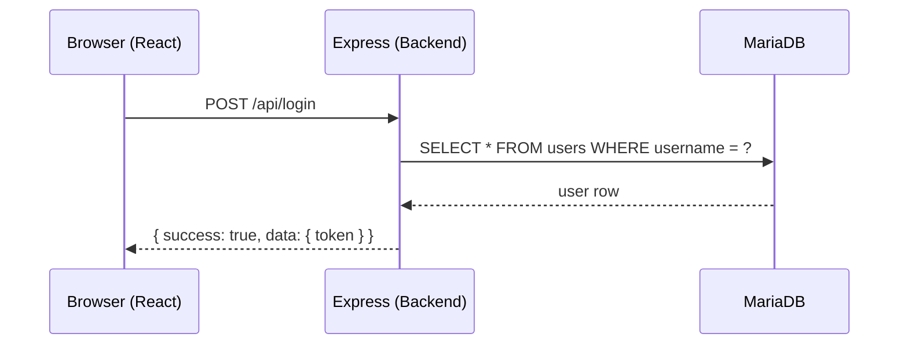
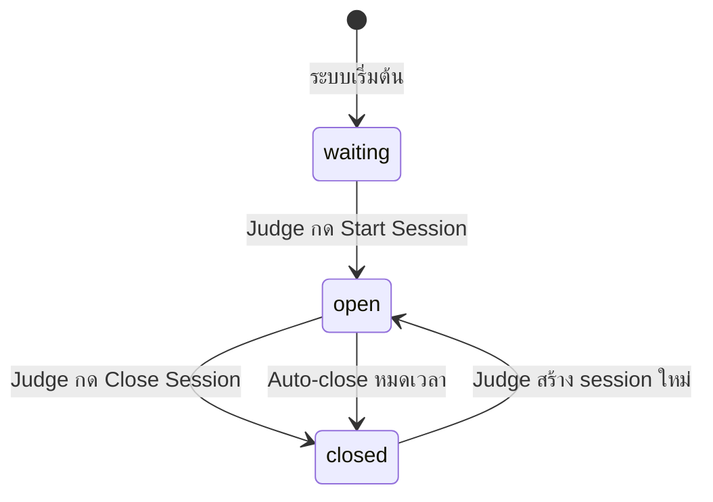

# บทที่ 2 — Backend คืออะไร

## ภาพรวมระบบที่เราจะสร้าง

| ส่วน | Technology | Port |
|------|-----------|------|
| Frontend | React + Vite + Tailwind CSS | 3000 |
| Backend | Node.js + Express | 8080 |
| Database | MariaDB | 3306 |

## Backend คือตัวกลาง

Browser ไม่ได้อ่านฐานข้อมูลโดยตรง — ต้องผ่าน backend ทุกครั้ง



## Pattern ที่ใช้ซ้ำทุก Endpoint

Request ทุกตัวไหลผ่านชั้นเดิมเสมอ:

```
URL → Route → Middleware → Controller → Database → JSON Response
```

เมื่อเข้าใจ pattern นี้ ทุก endpoint จะอ่านออกทันที

## 3 Roles ในระบบ

| Role | สิทธิ์ |
|------|--------|
| candidate | ส่ง URL, ดู submission และ result ของตัวเอง |
| judge | เปิด/ปิด session, ดู candidates, re-check, confirm score |
| manager | ดู statistics, export report (read-only) |

## API Endpoints ทั้งหมด 18 จุด

| Role | Method | Endpoint |
|------|--------|----------|
| ทุก Role | POST | /api/login |
| ทุก Role | POST | /api/logout |
| ทุก Role | GET | /api/config |
| ทุก Role | GET | /api/tasks |
| candidate | GET | /api/my-submission |
| candidate | POST | /api/my-submission |
| candidate | PUT | /api/my-submission |
| candidate | GET | /api/my-result |
| judge | GET | /api/candidates |
| judge | GET | /api/submissions |
| judge | PUT | /api/session/start |
| judge | PUT | /api/session/close |
| judge | POST | /api/submissions/:id/recheck |
| judge | PUT | /api/results/:candidate_id/confirm |
| manager | GET | /api/statistics/summary |
| manager | GET | /api/statistics/ranking |
| manager | GET | /api/statistics/status |
| manager | GET | /api/report |
| manager | GET | /api/sessions |

## Response Format มาตรฐาน

ทุก endpoint ตอบกลับ format เดียวกันเสมอ:

```json
{
  "success": true,
  "data": {},
  "meta": {}
}
```

ถ้าเกิด error:

```json
{
  "success": false,
  "message": "คำอธิบาย error"
}
```

List endpoint มี `meta` สำหรับ pagination:

```json
{
  "meta": {
    "total": 50,
    "page": 1,
    "per_page": 20,
    "last_page": 3
  }
}
```

## Session State Machine



session เริ่มต้นมีสถานะ `waiting` เมื่อ judge เปิดจะเป็น `open`
ครั้งต่อไปที่ judge เปิดใหม่ — ระบบจะ **สร้าง row ใหม่** ไม่แก้ไขของเดิม เพื่อเก็บ history
