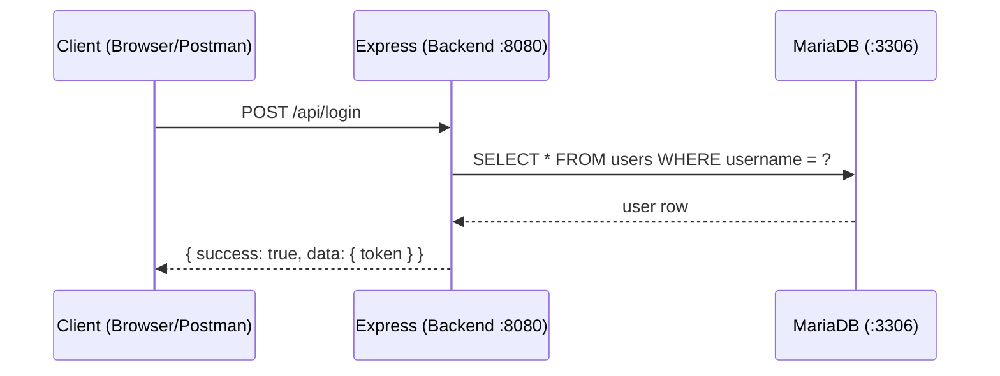

# บทที่ 2 — Backend คืออะไร

> **บทนี้ไม่มีโค้ด** — เข้าใจภาพรวมระบบทั้งหมดก่อนลงมือสร้าง

## Client คืออะไร

Client คือโปรแกรมที่ **ส่ง request** ขอข้อมูล ในโปรเจ็คนี้มี 2 แบบ:

| Client | ใช้ทำอะไร |
|--------|----------|
| Browser (React) | แสดงหน้าเว็บ ส่ง request ผ่าน fetch/axios |
| Postman | ทดสอบ API โดยตรง — ใช้ระหว่างพัฒนา |

## Server คืออะไร

Server คือโปรแกรมที่ **รับ request → ประมวลผล → ตอบกลับ**

ในโปรเจ็คนี้ใช้ **Node.js + Express** รันบน port 8080

- Node.js — รัน JavaScript นอก browser ได้
- Express — library สร้าง HTTP server ง่ายๆ บน Node.js

## Database คืออะไร

Database คือที่ **เก็บข้อมูล** ถาวร แม้ปิด server แล้วเปิดใหม่ข้อมูลยังอยู่

ในโปรเจ็คนี้ใช้ **MariaDB** รันบน port 3306

> Browser ไม่ได้อ่านฐานข้อมูลโดยตรง — ต้องผ่าน backend ทุกครั้ง

## ทั้งสามคุยกันอย่างไร



## REST API คืออะไร

REST API คือ **ข้อตกลงรูปแบบการสื่อสาร** ระหว่าง client กับ server โดยใช้:

| องค์ประกอบ | ตัวอย่าง | ความหมาย |
|------------|---------|----------|
| HTTP Method | `POST` | บอกว่า "จะทำอะไร" |
| URL | `/api/login` | บอกว่า "ทำกับอะไร" |
| JSON Body | `{ "username": "...", "password": "..." }` | ข้อมูลที่ส่งไป |
| JSON Response | `{ "success": true, "data": { "token": "..." } }` | ผลลัพธ์ที่ได้กลับมา |

### HTTP Methods ที่ใช้ในโปรเจ็คนี้

| Method | ใช้เมื่อ | ตัวอย่าง |
|--------|---------|---------|
| GET | ดึงข้อมูล | GET /api/tasks |
| POST | สร้างข้อมูลใหม่ / login | POST /api/login |
| PUT | แก้ไขข้อมูล | PUT /api/my-submission |

## ระบบที่เราจะสร้าง

ระบบมี 3 roles ที่มีสิทธิ์ต่างกัน:

| Role | สิ่งที่ทำได้ |
|------|------------|
| **candidate** | ส่ง URL งาน, ดู submission และ result ของตัวเอง |
| **judge** | เปิด/ปิด session, ดู candidates, recheck, confirm score |
| **manager** | ดู statistics, ranking, sessions, export report |

### API Endpoints ทั้งหมดที่จะสร้าง

| Method | Endpoint | Role |
|--------|----------|------|
| POST | /api/login | ทุก role |
| POST | /api/logout | ทุก role |
| GET | /api/config | ทุก role |
| GET | /api/tasks | ทุก role |
| GET | /api/my-submission | candidate |
| POST | /api/my-submission | candidate |
| PUT | /api/my-submission | candidate |
| GET | /api/my-result | candidate |
| PUT | /api/session/start | judge |
| PUT | /api/session/close | judge |
| GET | /api/candidates | judge |
| GET | /api/submissions | judge |
| POST | /api/submissions/:id/recheck | judge |
| PUT | /api/results/:candidate_id/confirm | judge |
| GET | /api/statistics/summary | manager |
| GET | /api/statistics/status | manager |
| GET | /api/statistics/ranking | manager |
| GET | /api/sessions | manager |
| GET | /api/report | manager |

## Response Format มาตรฐาน

ทุก endpoint ตอบกลับ format เดียวกันเสมอ:

```json
{ "success": true, "data": { ... }, "meta": {} }
```

ถ้าเกิด error:

```json
{ "success": false, "message": "คำอธิบาย error" }
```

> Pattern ที่ใช้ซ้ำทุก endpoint: **Route → Middleware → Controller → DB → JSON Response**
> เมื่อเข้าใจ pattern นี้ ทุก endpoint จะอ่านออกทันที
