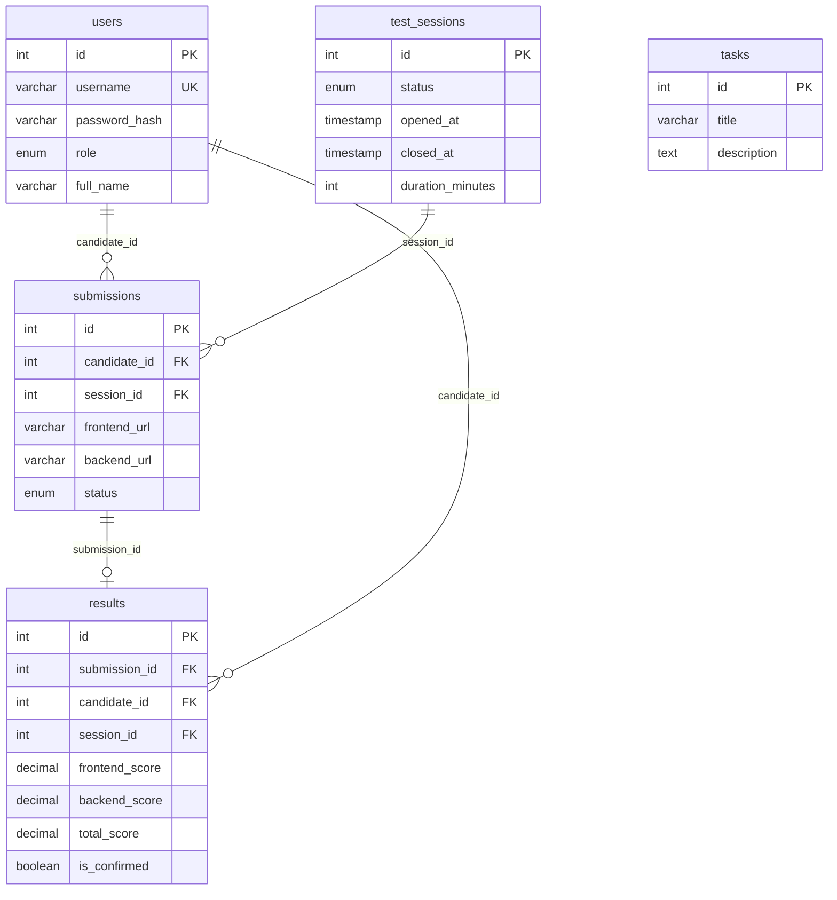

# บทที่ 4 — Database และ Schema

## ไฟล์ที่จะสร้างในบทนี้

| ไฟล์ | หน้าที่ |
|------|--------|
| `backend/database/schema.sql` | สร้าง database และ 5 tables |
| `backend/database/seed.js` | ใส่ข้อมูลเริ่มต้น (users, session, task) |

## ออกแบบ Database



## สร้าง: `backend/database/schema.sql`

```sql
CREATE DATABASE IF NOT EXISTS worldskill2026;
USE worldskill2026;

CREATE TABLE IF NOT EXISTS users (
  id            INT AUTO_INCREMENT PRIMARY KEY,
  username      VARCHAR(50)  UNIQUE NOT NULL,
  password_hash VARCHAR(255) NOT NULL,
  role          ENUM('candidate','judge','manager') NOT NULL,
  full_name     VARCHAR(100) NOT NULL,
  created_at    TIMESTAMP DEFAULT CURRENT_TIMESTAMP
);

CREATE TABLE IF NOT EXISTS test_sessions (
  id               INT AUTO_INCREMENT PRIMARY KEY,
  status           ENUM('waiting','open','closed') DEFAULT 'waiting',
  opened_at        TIMESTAMP NULL,
  closed_at        TIMESTAMP NULL,
  duration_minutes INT DEFAULT 90,
  created_at       TIMESTAMP DEFAULT CURRENT_TIMESTAMP
);

CREATE TABLE IF NOT EXISTS tasks (
  id          INT AUTO_INCREMENT PRIMARY KEY,
  title       VARCHAR(200) NOT NULL,
  description TEXT NOT NULL,
  created_at  TIMESTAMP DEFAULT CURRENT_TIMESTAMP
);

CREATE TABLE IF NOT EXISTS submissions (
  id           INT AUTO_INCREMENT PRIMARY KEY,
  candidate_id INT NOT NULL,
  session_id   INT NOT NULL,
  frontend_url VARCHAR(500),
  backend_url  VARCHAR(500),
  status       ENUM('pending','checking','checked') DEFAULT 'pending',
  submitted_at TIMESTAMP DEFAULT CURRENT_TIMESTAMP,
  updated_at   TIMESTAMP DEFAULT CURRENT_TIMESTAMP ON UPDATE CURRENT_TIMESTAMP,
  FOREIGN KEY (candidate_id) REFERENCES users(id),
  FOREIGN KEY (session_id)   REFERENCES test_sessions(id),
  UNIQUE KEY unique_candidate_session (candidate_id, session_id)
);

CREATE TABLE IF NOT EXISTS results (
  id              INT AUTO_INCREMENT PRIMARY KEY,
  submission_id   INT NOT NULL,
  candidate_id    INT NOT NULL,
  session_id      INT NOT NULL,
  frontend_score  DECIMAL(5,2) DEFAULT 0,
  backend_score   DECIMAL(5,2) DEFAULT 0,
  total_score     DECIMAL(5,2) DEFAULT 0,
  is_confirmed    BOOLEAN DEFAULT FALSE,
  confirmed_by    INT NULL,
  confirmed_at    TIMESTAMP NULL,
  notes           TEXT,
  created_at      TIMESTAMP DEFAULT CURRENT_TIMESTAMP,
  updated_at      TIMESTAMP DEFAULT CURRENT_TIMESTAMP ON UPDATE CURRENT_TIMESTAMP,
  FOREIGN KEY (submission_id) REFERENCES submissions(id),
  FOREIGN KEY (candidate_id)  REFERENCES users(id),
  FOREIGN KEY (session_id)    REFERENCES test_sessions(id),
  FOREIGN KEY (confirmed_by)  REFERENCES users(id)
);
```

**สิ่งสำคัญในโค้ดนี้:**
- `UNIQUE KEY unique_candidate_session (candidate_id, session_id)` — บังคับให้ 1 candidate มีได้แค่ 1 submission ต่อ session
- `ENUM('waiting','open','closed')` — status ของ session มีได้แค่ 3 ค่าเท่านั้น
- `FOREIGN KEY` — เชื่อม table เข้าด้วยกัน ถ้าอ้างถึง id ที่ไม่มีจะ error

## สร้าง: `backend/database/seed.js`

```js
require('dotenv').config({ path: require('path').join(__dirname, '../.env') });
const mysql  = require('mysql2/promise');
const bcrypt = require('bcryptjs');
const fs     = require('fs');
const path   = require('path');

async function seed() {
  const conn = await mysql.createConnection({
    host:     process.env.DB_HOST,
    port:     process.env.DB_PORT,
    user:     process.env.DB_USER,
    password: process.env.DB_PASSWORD,
    multipleStatements: true,
  });

  console.log('Running schema...');
  const sql = fs.readFileSync(path.join(__dirname, 'schema.sql'), 'utf8');
  await conn.query(sql);
  console.log('  ✓ schema applied');

  const ROUNDS = 10;

  const users = [
    { username: 'judge01',     password: 'judge123',   role: 'judge',     full_name: 'Judge One'   },
    { username: 'manager01',   password: 'manager123', role: 'manager',   full_name: 'Manager One' },
    { username: 'candidate01', password: 'cand123',    role: 'candidate', full_name: 'Alice Johnson'},
    { username: 'candidate02', password: 'cand123',    role: 'candidate', full_name: 'Bob Smith'   },
    { username: 'candidate03', password: 'cand123',    role: 'candidate', full_name: 'Carol Davis' },
    { username: 'candidate04', password: 'cand123',    role: 'candidate', full_name: 'David Wilson'},
    { username: 'candidate05', password: 'cand123',    role: 'candidate', full_name: 'Eva Martinez'},
  ];

  console.log('\nSeeding users...');
  for (const u of users) {
    const hash = await bcrypt.hash(u.password, ROUNDS);
    await conn.execute(
      'INSERT IGNORE INTO worldskill2026.users (username, password_hash, role, full_name) VALUES (?, ?, ?, ?)',
      [u.username, hash, u.role, u.full_name]
    );
    console.log(`  ✓ ${u.role.padEnd(9)} ${u.username}`);
  }

  await conn.execute(
    'INSERT IGNORE INTO worldskill2026.test_sessions (id, status, duration_minutes) VALUES (1, "waiting", 90)'
  );
  console.log('  ✓ session (id=1, status=waiting)');

  const taskDesc = [
    'Build a full-stack Test Submission Management System.',
    '',
    'Frontend: React + Vite + Tailwind CSS (port 3000)',
    'Backend:  Node.js + Express + MariaDB (port 8080)',
    '',
    'Roles:',
    '  Candidate — submit Frontend URL and Backend API URL',
    '  Judge     — manage session, review submissions, confirm scores',
    '  Manager   — view statistics and export reports',
    '',
    'The application must run without internet access on the local LAN.',
  ].join('\n');

  await conn.execute(
    'INSERT IGNORE INTO worldskill2026.tasks (id, title, description) VALUES (1, ?, ?)',
    ['Web Technologies Competition Task', taskDesc]
  );
  console.log('  ✓ task (id=1)');

  console.log('\nSeed completed.');
  await conn.end();
}

seed().catch((err) => { console.error(err); process.exit(1); });
```

**สิ่งสำคัญในโค้ดนี้:**
- `multipleStatements: true` — อนุญาต connection นี้รัน SQL หลาย statement พร้อมกัน (schema.sql ต้องการ)
- `bcrypt.hash(u.password, ROUNDS)` — เข้ารหัส password ก่อนเก็บ ไม่เก็บ password ตรงๆ เด็ดขาด
- `INSERT IGNORE` — ถ้า record นั้นมีอยู่แล้วจะข้ามไป ไม่ error (รัน seed ซ้ำได้)

## รัน Seed

```bash
cd backend
npm run seed
```

ต้องเห็น:
```
Running schema...
  ✓ schema applied

Seeding users...
  ✓ judge     judge01
  ✓ manager   manager01
  ✓ candidate candidate01
  ✓ candidate candidate02
  ✓ candidate candidate03
  ✓ candidate candidate04
  ✓ candidate candidate05
  ✓ session (id=1, status=waiting)
  ✓ task (id=1)

Seed completed.
```

## ตรวจสอบใน MariaDB

```bash
mysql -u root -p worldskill2026
```

```sql
SELECT id, username, role FROM users;
SELECT id, status FROM test_sessions;
```

ต้องเห็น users 7 คน และ session 1 แถว

ออกจาก MariaDB:
```sql
exit
```

## ข้อมูล Login สำหรับทดสอบ

| Role | Username | Password |
|------|----------|----------|
| judge | judge01 | judge123 |
| manager | manager01 | manager123 |
| candidate | candidate01–05 | cand123 |

## Common Errors

| Error | สาเหตุ | วิธีแก้ |
|-------|--------|---------|
| `Access denied for user 'root'` | รหัสผ่าน MariaDB ผิดใน `.env` | แก้ `DB_PASSWORD` ใน `.env` |
| `Cannot find module '../.env'` | รัน seed จากผิดโฟลเดอร์ | ตรวจว่า `cd backend` ก่อน |
| `ER_PARSE_ERROR` | schema.sql มี syntax ผิด | ตรวจทานโค้ด SQL ทุกบรรทัด |
| `ECONNREFUSED` | MariaDB ไม่ได้เปิด | เปิด Service MariaDB ก่อน |
