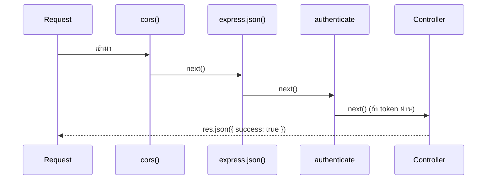

# บทที่ 5 — Express คืออะไร

> **บทนี้เตรียมอะไร:** เรียนรู้ Express concept + ลองรัน Express server ตัวแรก (Hello World) ก่อนที่จะค่อย ๆ ต่อยอดในบทที่ 6–8

## Express คือ Framework ไม่ใช่ภาษา

Node.js คือ runtime ที่ทำให้รัน JavaScript นอก browser ได้
Express คือ library ที่สร้างอยู่บน Node.js เพื่อทำให้งาน web server ง่ายขึ้น

```
Node.js  →  รันโค้ดได้
Express  →  รับ HTTP request, จัดการ routing, ส่ง response
```

ถ้าไม่มี Express ก็ต้องเขียน HTTP server เองซึ่งยากกว่ามาก

## HTTP Request คืออะไร

ทุกครั้งที่ browser หรือ Postman ส่ง request มาจะมีข้อมูล:

| ส่วน | ตัวอย่าง | ใช้งานใน Express |
|------|---------|----------------|
| Method | GET, POST, PUT, DELETE | `router.get()`, `router.post()` |
| URL Path | `/api/login` | กำหนดใน route |
| Headers | `Authorization: Bearer token` | `req.headers` |
| Body | `{ "username": "judge01" }` | `req.body` |
| Query String | `?page=2&limit=10` | `req.query` |

## Route คืออะไร

Route คือกฎที่บอกว่า "ถ้า request มา URL นี้ด้วย method นี้ → ให้รันฟังก์ชันนี้"

```js
router.post('/login', functionName)
//     ↑       ↑           ↑
//   method   path      ฟังก์ชันที่จะรัน
```

## Middleware คืออะไร

Middleware คือฟังก์ชันที่ **คั่นกลาง** ระหว่าง request กับ controller ทำงานเหมือน "ด่านตรวจ"



ถ้า middleware เรียก **`next()`** → ส่งต่อไปด่านถัดไป
ถ้า middleware เรียก **`res.json()`** → หยุดทันที ไม่ไปถึง controller

## req, res, next คืออะไร

ทุก middleware และ controller ได้รับ 3 ตัวแปรนี้เสมอ:

| ตัวแปร | ย่อมาจาก | ใช้ทำอะไร |
|--------|---------|----------|
| `req` | request | ข้อมูลที่ client ส่งมา เช่น `req.body`, `req.headers`, `req.params` |
| `res` | response | ส่งข้อมูลกลับ client ด้วย `res.json()`, `res.status(401).json()` |
| `next` | next middleware | เรียก `next()` เพื่อส่งต่อไปขั้นถัดไป |

## Router คืออะไร และทำไมต้องแยกไฟล์

Router คือกลุ่มของ route ที่เกี่ยวข้องกัน รวมไว้ในไฟล์เดียว

```
app.js          ← จุดรวม route ทั้งหมด
routes/auth.js  ← route ที่เกี่ยวกับ auth (login, logout)
routes/tasks.js ← route ที่เกี่ยวกับ tasks
```

ถ้าไม่แยกไฟล์ app.js จะยาวหลายร้อยบรรทัดและหาของยาก

## โครงสร้าง Request ใน Project นี้

```
HTTP Request
    ↓
app.js          (cors + express.json + autoClose)
    ↓
routes/auth.js  (จับ URL /api/login)
    ↓
authenticate    (ตรวจ JWT token)
    ↓
authorize       (ตรวจ role)
    ↓
authController  (query database → res.json)
    ↓
HTTP Response
```

## ลองสร้าง Express Server เบื้องต้น

ก่อนไปเรียนบทที่ 6–8 (dotenv, cors, mysql2) ให้ลองสร้าง server เล็ก ๆ ขึ้นมาก่อนเพื่อให้เห็นว่า Express ทำงานยังไง

> นี่คือโค้ดที่ง่ายที่สุด ยังไม่มี dotenv, cors หรือ mysql2 — เพื่อให้เห็น Express เปล่า ๆ ก่อน

เปิดไฟล์ `backend/src/app.js` แล้วพิมพ์:

```js
const express = require('express');
const app = express();

app.get('/', (req, res) => {
  res.send('Hello from Express!');
});

const PORT = 8080;
app.listen(PORT, () => console.log(`Server running on http://localhost:${PORT}`));
```

**อธิบายทีละบรรทัด:**

`const express = require('express')` — โหลด Express library เข้ามาใช้งาน

`const app = express()` — สร้าง Express application instance ตัวนี้คือ "ตัว server" ที่เราจะตั้งค่า

`app.get('/', (req, res) => { ... })` — กำหนด route: "ถ้ามี GET request มาที่ `/` ให้รันฟังก์ชันนี้"

`res.send('Hello from Express!')` — ส่ง text กลับไปให้ client

`const PORT = 8080` — กำหนด port ที่ server จะฟัง (ยังเป็น hardcode อยู่ในตอนนี้ — บทที่ 6 จะย้ายมาไว้ใน `.env`)

`app.listen(PORT, callback)` — เริ่มรับ HTTP request callback จะถูกเรียกหนึ่งครั้งตอน server พร้อม

## ทดสอบ

### ขั้นที่ 1 — ตรวจว่า Express พร้อมใช้งาน

```bash
node -e "const e = require('express'); console.log('Express:', e.version)"
```

ต้องเห็น:
```
Express: 4.x.x
```

ถ้าขึ้น `Cannot find module 'express'` แสดงว่า `npm install` ยังไม่เสร็จ กลับไปบทที่ 3

### ขั้นที่ 2 — รัน server เบื้องต้น

```bash
node src/app.js
```

ต้องเห็น:
```
Server running on http://localhost:8080
```

### ขั้นที่ 3 — ทดสอบใน Postman

```
GET http://localhost:8080/
```

ต้องได้:
```
Hello from Express!
```

> **จบแล้ว!** นี่คือ Express server ตัวแรก ยังง่ายมากและยังไม่ครบ — บทที่ 6–8 จะค่อย ๆ ต่อยอดทีละขั้นจนสมบูรณ์

**ตอบได้ไหม:**
1. `req.body` คืออะไร → ข้อมูล JSON ที่ client ส่งมาใน body
2. `next()` ใน middleware ทำอะไร → ส่งต่อไป middleware หรือ controller ถัดไป
3. ทำไมต้องแยก routes เป็นหลายไฟล์ → เพื่อจัดระเบียบ หาและแก้ได้ง่าย
4. ถ้า middleware เรียก `res.json()` แทน `next()` จะเกิดอะไร → หยุดทันที controller ไม่ทำงาน

## Common Errors

| สถานการณ์ | สาเหตุ | วิธีแก้ |
|----------|--------|---------|
| `Cannot find module 'express'` | npm install ยังไม่ได้รัน | `cd backend && npm install` |
| เข้าใจ middleware ไม่ได้ | ปกติมาก | อ่านซ้ำส่วน "Middleware คืออะไร" + diagram อีกครั้ง |
