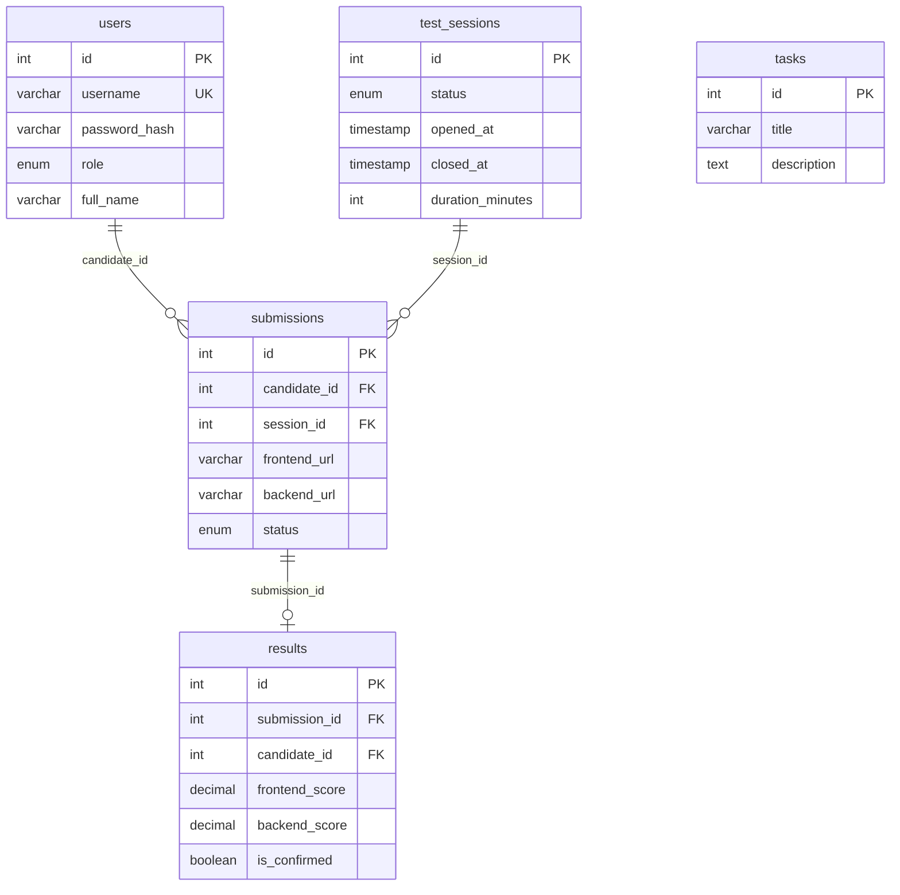

# บทที่ 8 — Database & SQL

> **บทนี้เตรียมอะไร:** เรียน SQL Commands ที่ต้องใช้จริงตอนแข่ง + Import schema จากกรรมการ — ไม่เปลี่ยน `app.js` ในบทนี้

## Database ในระบบนี้

ระบบใช้ **MariaDB** เก็บข้อมูล 5 ตาราง:

| ตาราง | เก็บข้อมูล |
|-------|----------|
| `users` | ข้อมูลผู้ใช้ทุก role |
| `test_sessions` | session การแข่งขัน |
| `tasks` | โจทย์ที่กรรมการกำหนด |
| `submissions` | URL ที่ candidate ส่ง |
| `results` | คะแนนที่ judge ให้ |



## SQL Commands ที่ต้องรู้

เปิด Terminal แล้วเข้า MariaDB:

```bash
mysql -u root -p
```

พิมพ์รหัสผ่าน กด Enter (ตัวอักษรจะไม่แสดง — ปกติ)

คำสั่งที่ใช้บ่อยภายใน MariaDB prompt:

```sql
SHOW DATABASES;
USE worldskill2026;
SHOW TABLES;
DESCRIBE users;
SELECT id, username, role FROM users;
SELECT id, status FROM test_sessions;
EXIT;
```

## Import Schema — สำคัญสุดตอนแข่ง

:::warning
กรรมการจะให้ไฟล์ `.sql` มา ใช้คำสั่งนี้ import ได้เลย — รันจาก terminal ข้างนอก mysql (ไม่ใช่ภายใน MariaDB prompt)
:::

```bash
mysql -u root -p worldskill2026 < schema.sql
```

> ถ้า database ยังไม่มี ต้องสร้างก่อน: `CREATE DATABASE worldskill2026;` ภายใน MariaDB แล้วค่อย import

## ชิ้นงาน — รัน Seed

สำหรับการฝึกซ้อม กรรมการเตรียม `seed.js` ไว้ให้แล้วใน `database/` — รันเพื่อสร้างข้อมูลตัวอย่าง:

```bash
npm run seed
```

ต้องเห็น:
```
Running schema...
  ✓ schema applied

Seeding users...
  ✓ judge     judge01
  ✓ manager   manager01
  ✓ candidate candidate01
  ✓ candidate candidate02
  ✓ candidate candidate03
  ✓ candidate candidate04
  ✓ candidate candidate05
  ✓ session (id=1, status=waiting)
  ✓ task (id=1)

Seed completed.
```

## ตรวจสอบ

```bash
mysql -u root -p worldskill2026
```

```sql
SELECT id, username, role FROM users;
SELECT id, status FROM test_sessions;
EXIT;
```

ต้องเห็น users 7 คน และ session 1 แถว

## ข้อมูล Login สำหรับทดสอบ

| Role | Username | Password |
|------|----------|----------|
| judge | judge01 | judge123 |
| manager | manager01 | manager123 |
| candidate | candidate01–05 | cand123 |

## Common Errors

| Error | สาเหตุ | วิธีแก้ |
|-------|--------|---------| 
| `Access denied for user 'root'` | รหัสผ่านผิด | ตรวจ `DB_PASSWORD` ใน `.env` |
| `Unknown database 'worldskill2026'` | ยังไม่ได้ import schema | รัน `npm run seed` |
| `ECONNREFUSED 127.0.0.1:3306` | MariaDB ไม่ได้เปิด | เปิด MariaDB service ก่อน |
