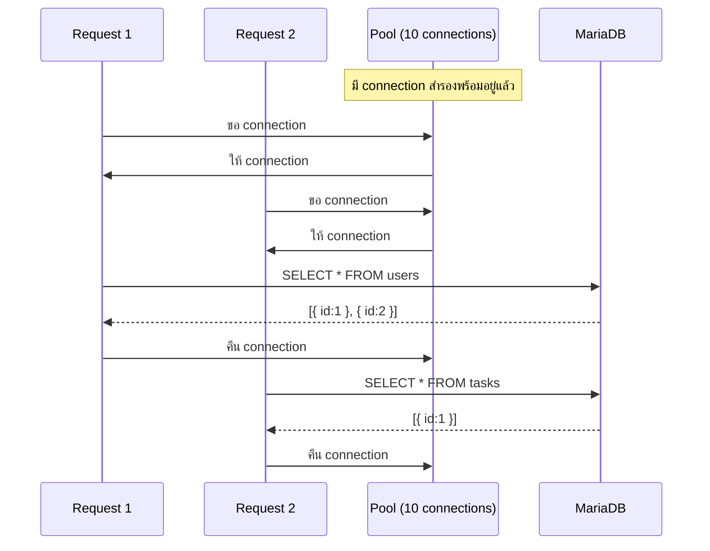

# บทที่ 8 — mysql2: เชื่อมต่อ Database

> **บทนี้เตรียมอะไร:** สอน mysql2 + สร้าง `src/config/db.js` และเปลี่ยน `app.js` เป็น skeleton จริง (skeleton ที่ 3 ไลน์ผ่าน Hello World route ออกไปแล้ว)

## ปัญหา — Node.js คุยกับ MariaDB ไม่ได้โดยตรง

MariaDB เป็นโปรแกรมแยกต่างหากที่รับคำสั่งผ่าน **MySQL Protocol** ซึ่งเป็นภาษาเฉพาะทาง Node.js ไม่รู้วิธีคุยด้วยโดยธรรมชาติ ต้องมี library ทำหน้าที่เป็น "ล่าม" แปลคำสั่ง JavaScript ให้เป็น MySQL Protocol และแปลผลลัพธ์กลับมาเป็น JavaScript object

```
JavaScript code          mysql2              MariaDB
─────────────           ────────           ──────────
pool.execute(...)   →   MySQL Protocol  →  รัน SQL
                    ←   ผลลัพธ์         ←  ส่งกลับ
[{ id:1, ... }]    ←   แปลเป็น JS       
```

## ทำไมถึงใช้ mysql2 ไม่ใช่ตัวอื่น

| ตัวเลือก | เหตุผลที่ไม่ใช้ |
|---------|--------------|
| `mysql` (v1) | ไม่รองรับ Promise/async-await ต้องใช้ callback style ที่เขียนยากกว่า |
| `sequelize`, `prisma` | ORM ที่ซับซ้อน สร้าง abstraction หลายชั้น สำหรับการแข่งขันที่ต้องการความเร็วในการเขียน raw SQL ชัดเจนกว่า |
| `mysql2` | รองรับ Promise และ async/await โดยตรง เร็ว เสถียร เป็น standard สำหรับ Node.js + MySQL/MariaDB |

## Connection Pool คืออะไร และทำไมต้องใช้

เมื่อโค้ดต้องการ query database มีสองวิธี:

### วิธีที่ 1 — สร้าง Connection ใหม่ทุกครั้ง (ไม่ดี)

```js
// ทุก request สร้าง connection ใหม่ แล้วปิดหลังเสร็จ
async function getUsers() {
  const conn = await mysql.createConnection({ ... });  // เปิด
  const [rows] = await conn.execute('SELECT * FROM users');
  await conn.end();                                      // ปิด
  return rows;
}
```

ปัญหา: การเปิด TCP connection ใหม่กับ MariaDB ใช้เวลาประมาณ 10-50ms ถ้ามี 100 request พร้อมกัน จะสร้างและปิด connection 100 ครั้ง — ช้าและเปลืองทรัพยากรมาก

### วิธีที่ 2 — Connection Pool (ดี)

```js
// สร้าง pool ครั้งเดียวตอน startup
const pool = mysql.createPool({ connectionLimit: 10, ... });

// ทุก request ยืม connection จาก pool แล้วคืนกลับ
async function getUsers() {
  const [rows] = await pool.execute('SELECT * FROM users');
  // connection คืน pool อัตโนมัติ
  return rows;
}
```

Pool สร้าง connection ไว้ 10 ตัวพร้อม ทุก request ที่เข้ามาจะยืม connection ที่ว่างมาใช้ พอเสร็จก็คืน pool แทนการปิดทิ้ง



## วิธีสร้าง Pool ด้วย mysql2

```js
const mysql = require('mysql2/promise');

const pool = mysql.createPool({
  host:             process.env.DB_HOST,
  port:             process.env.DB_PORT,
  user:             process.env.DB_USER,
  password:         process.env.DB_PASSWORD,
  database:         process.env.DB_NAME,
  waitForConnections: true,
  connectionLimit:  10,
});
```

**อธิบายทีละส่วน:**

`require('mysql2/promise')` — ต้องระบุ `/promise` เพื่อบอกให้ mysql2 ส่งคืน Promise แทน callback ถ้าไม่มี `/promise` จะต้องใช้ callback style แบบเดิมซึ่งยากกว่า

`process.env.DB_HOST` เป็นต้น — อ่านค่าจาก `.env` ผ่าน dotenv ที่เรียนในบทที่ 6 ไม่ได้เขียนค่าตรงๆ ในโค้ด

`waitForConnections: true` — ถ้า connection ทั้ง 10 ตัวถูกใช้งานอยู่ ให้ request ใหม่รอในคิวแทนที่จะ error ทันที

`connectionLimit: 10` — จำนวน connection สูงสุดที่ pool ดูแล เพียงพอสำหรับ development

## execute() ทำงานยังไง

`execute()` คือ method หลักที่เราใช้ส่ง SQL query ไปยัง database

```js
const [rows, fields] = await pool.execute(sql, params);
```

method คืน array 2 ตัวเสมอ:
- `rows` — ผลลัพธ์ที่ได้ (array ของ object แต่ละ row)
- `fields` — metadata ของ column (แทบไม่ได้ใช้)

เพราะฉะนั้นในโค้ดจริงเราจะ destructure เอาแค่ `rows`:

```js
const [rows] = await pool.execute('SELECT * FROM users');
```

## ผลลัพธ์จาก execute() มีหน้าตาแบบไหน

### SELECT — ได้ array ของ object

```js
const [rows] = await pool.execute('SELECT * FROM users');

console.log(rows);
// [
//   { id: 1, username: 'judge01', role: 'judge', full_name: 'Judge One' },
//   { id: 2, username: 'manager01', role: 'manager', full_name: 'Manager One' },
//   ...
// ]

console.log(rows[0]);           // { id: 1, username: 'judge01', ... }
console.log(rows[0].username);  // 'judge01'
console.log(rows.length);       // จำนวน row ทั้งหมด
```

ถ้าไม่มีข้อมูลที่ตรง:
```js
const [rows] = await pool.execute('SELECT * FROM users WHERE username = ?', ['notexist']);
console.log(rows);    // []         — array ว่าง
console.log(rows[0]); // undefined  — ไม่มี element แรก
```

### INSERT / UPDATE / DELETE — ได้ metadata

```js
const [result] = await pool.execute('INSERT INTO tasks (title) VALUES (?)', ['Task 1']);

console.log(result.insertId);      // id ของ row ที่เพิ่งเพิ่ม
console.log(result.affectedRows);  // จำนวน row ที่ถูกแก้ไข
```

## Prepared Statement — ป้องกัน SQL Injection

`?` ใน SQL คือ placeholder สำหรับ Prepared Statement:

```js
// ✅ ปลอดภัย — ใช้ ? และส่งค่าเป็น array ตัวที่สอง
pool.execute(
  'SELECT * FROM users WHERE username = ? AND role = ?',
  [username, role]
);
```

```js
// ❌ อันตราย — นำค่าใส่ตรงใน SQL string (SQL Injection)
pool.execute(`SELECT * FROM users WHERE username = '${username}'`);
```

**ทำไม ? ถึงปลอดภัย:**

ถ้าใช้ template string และผู้ใช้ส่ง username ว่า `' OR 1=1 --`:
```sql
-- สร้าง SQL อันตราย
SELECT * FROM users WHERE username = '' OR 1=1 --'
-- ดึงทุก user ออกมา!
```

เมื่อใช้ `?` mysql2 จะ escape ค่านั้นก่อนใส่ใน query ทำให้ไม่สามารถฝัง SQL ได้

## สร้าง: `backend/src/config/db.js`

ไฟล์นี้มีหน้าที่เดียว: **สร้าง connection pool แล้ว export ออกไปให้ controller ทุกตัวใช้**

สร้างโฟลเดอร์ `src/config/` แล้วสร้างไฟล์ `db.js`:

```js
const mysql = require('mysql2/promise');
require('dotenv').config();

const pool = mysql.createPool({
  host:             process.env.DB_HOST,
  port:             process.env.DB_PORT,
  user:             process.env.DB_USER,
  password:         process.env.DB_PASSWORD,
  database:         process.env.DB_NAME,
  waitForConnections: true,
  connectionLimit:  10,
});

module.exports = pool;
```

`module.exports = pool` — export pool object ออกไป ทุก controller จะ `require('../config/db')` เพื่อใช้งาน

> Pattern: ทุก controller ในโปรเจกต์นี้จะเริ่มต้นด้วย `const pool = require('../config/db')` เสมอ

## อัปเดต app.js — Skeleton จริง

บทที่ 7 เราหยุดที่ app.js ยังมี `app.get('/', ...)` อยู่ ตอนนี้ลบออกได้แล้ว server พร้อมรับ route จริงตั้งแต่บทที่ 10 เป็นต้นไป

แก้ `backend/src/app.js` เป็น:

```js
// app.js — skeleton สมบูรณ์ (บทที่ 8)
require('dotenv').config();
const express = require('express');
const cors    = require('cors');

const app = express();

app.use(cors({ origin: process.env.FRONTEND_URL }));
app.use(express.json());

const PORT = process.env.PORT || 8080;
app.listen(PORT, () => console.log(`Backend running on http://localhost:${PORT}`));
```

**สิ่งที่เปลี่ยนจากบทที่ 7:** ลบ `app.get('/', ...)` ออก — Hello World ไม่จำเป็นแล้ว นี่คือ skeleton จริงที่รอ route จากบทถัดไป

## ทดสอบ

### ขั้นที่ 1 — ตรวจ database connection

```bash
node -e "require('dotenv').config(); const pool = require('./src/config/db'); pool.execute('SELECT 1').then(() => { console.log('mysql2: OK'); process.exit(); }).catch(e => { console.error('Error:', e.message); process.exit(1); })"
```

ต้องเห็น:
```
mysql2: OK
```

### ขั้นที่ 2 — รัน server

```bash
npm run dev
```

ต้องเห็น:
```
Backend running on http://localhost:8080
```

### ขั้นที่ 3 — ทดสอบใน Postman

```
GET http://localhost:8080/anything
```

ต้องได้ **404** — สัญญาณที่ถูกต้อง หมายความว่า server รับ request ได้แล้ว แต่ยังไม่มี route ใดๆ — route จริงจะเริ่มเพิ่มตั้งแต่บทที่ 10


## Common Errors

| Error | สาเหตุ | วิธีแก้ |
|-------|--------|---------|
| `Access denied for user 'root'` | `DB_PASSWORD` ใน `.env` ผิด | ตรวจรหัสผ่านที่ตั้งตอนติดตั้ง MariaDB |
| `ECONNREFUSED 127.0.0.1:3306` | MariaDB ไม่ได้เปิด | เปิด MariaDB service ก่อนรัน server |
| `Unknown database 'worldskill2026'` | ยังไม่ได้ import schema | รัน `npm run seed` ในบทที่ 4 |
| `Cannot find module 'mysql2'` | ยังไม่ได้ npm install | รัน `npm install` ใน `backend/` |
| `TypeError: pool.execute is not a function` | ลืม `/promise` ใน require | ใช้ `require('mysql2/promise')` ไม่ใช่ `require('mysql2')` |
