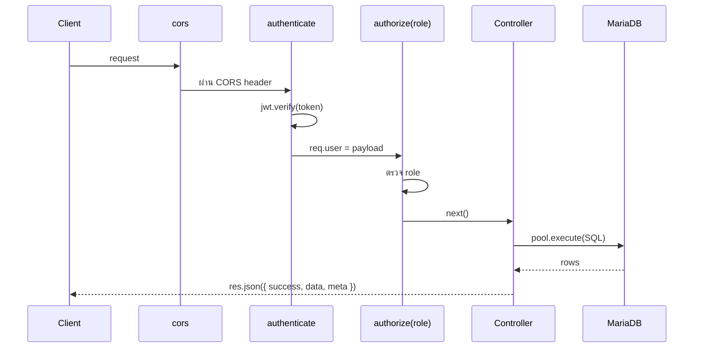

# บทที่ 14 — Architecture

> **บทนี้เตรียมอะไร:** เข้าใจโครงสร้างระบบก่อน API จริงจะเริ่ม — บทนี้ไม่มี endpoint ใหม่

## ส่วนที่ 1 — สร้าง `src/middlewares/role.js`

### ปัญหา — Token บอกว่า "ใคร" แต่ไม่ได้บอกว่า "ทำอะไรได้"

`authenticate` ตรวจแค่ว่า token ถูกต้องไหม — ไม่ได้ตรวจว่า role นั้นมีสิทธิ์ใช้ endpoint นั้นไหม:

```
GET /api/candidates  (endpoint ของ judge เท่านั้น)
├── candidate01 ส่ง token → authenticate ผ่าน ❌ ไม่ควรเข้าได้
└── judge01     ส่ง token → authenticate ผ่าน ✅ เข้าได้
```

ถ้าไม่มี role check — candidate สามารถเข้า endpoint ของ judge ได้ทั้งหมด

### 401 vs 403

| Status | ความหมาย | เกิดเมื่อ |
|--------|----------|-----------|
| 401 | ไม่รู้ว่าคุณคือใคร | ไม่มี token หรือ token ผิด/หมดอายุ |
| 403 | รู้แล้วว่าคุณคือใคร แต่ไม่มีสิทธิ์ | token ถูก แต่ role ไม่ตรง |

### วิธีแก้ — `authorize()` ตรวจ role ต่อจาก authenticate

```
authenticate → req.user = { id, role, ... }
authorize('judge') → เช็คว่า req.user.role === 'judge' ไหม
```

### ชิ้นงาน — สร้าง `src/middlewares/role.js`

```
backend/
└── src/
    └── middlewares/
        ├── auth.js
        └── role.js   ← สร้างในบทนี้
```

สร้างไฟล์ `backend/src/middlewares/role.js`:

```js
// role.js — ตรวจสิทธิ์ตาม role หลังจาก authenticate แล้ว
function authorize(...roles) {         // ...roles รับได้หลาย role: authorize('judge', 'manager')
  return (req, res, next) => {
    if (!roles.includes(req.user.role)) {  // req.user มาจาก authenticate ก่อนหน้า
      return res.status(403).json({ success: false, message: 'Access denied' });
    }
    next();
  };
}

module.exports = authorize;
```

:::tip
`authorize` คืน function — ทำให้เรียกใช้แบบ `authorize('judge')` แล้วได้ middleware ไปเลย
นี่คือ pattern ที่เรียกว่า "higher-order function"
:::

### การใช้งานใน Route

```js
const authenticate = require('../middlewares/auth');
const authorize    = require('../middlewares/role');

// authenticate ก่อน → ได้ req.user → authorize ตรวจ role
router.get('/candidates', authenticate, authorize('judge'), ctrl.fn);
router.get('/my-submission', authenticate, authorize('candidate'), ctrl.fn);
router.get('/statistics/summary', authenticate, authorize('manager'), ctrl.fn);

// รับได้หลาย role
router.get('/tasks', authenticate, authorize('candidate', 'judge', 'manager'), ctrl.fn);
```

:::warning
ต้องใส่ `authenticate` ก่อน `authorize` เสมอ — ถ้าสลับลำดับ `req.user` จะยังไม่มีค่าตอนที่ `authorize` รัน
:::

## ส่วนที่ 2 — Request Flow Diagram

ทุก request ไหลผ่านชั้นเดิมเสมอ:



## ส่วนที่ 3 — Middleware Order ใน app.js

ลำดับ middleware มีความสำคัญมาก — ผิดลำดับทำงานผิด:

```js
app.use(cors(...));           // 1. cors ก่อนเสมอ — browser preflight ต้องผ่านก่อน
app.use(express.json());      // 2. parse body — route ถึงจะอ่าน req.body ได้
app.use(autoClose);           // 3. autoClose — จะเพิ่มในบทที่ 20
app.use('/api', authRoute);   // 4. routes
```

## ส่วนที่ 4 — HTTP Status Codes ที่ใช้ในโปรเจ็คนี้

| Code | ใช้เมื่อ |
|------|---------|
| 200 | สำเร็จ (default) |
| 400 | ข้อมูลที่ส่งมาไม่ครบหรือผิดรูปแบบ |
| 401 | ไม่มี token หรือ token ผิด |
| 403 | มี token แต่ role ไม่มีสิทธิ์ |
| 404 | ไม่พบข้อมูลที่ขอ |
| 409 | ข้อมูลซ้ำ (เช่น submission ซ้ำใน session เดิม) |
| 500 | server error (catch จาก try/catch) |

## ส่วนที่ 5 — Response Format มาตรฐาน

ทุก endpoint ต้องส่งใน format นี้ตามโจทย์ TP2026:

```js
// สำเร็จ — single object
res.json({ success: true, data: { ... }, meta: {} });

// สำเร็จ — list
res.json({ success: true, data: [ ... ], meta: {} });

// error
res.status(400).json({ success: false, message: 'reason' });
```

:::warning
ห้ามส่ง response format อื่น — กรรมการตรวจจาก `success`, `data`, `meta` โดยตรง
:::

## Pattern ที่ใช้ซ้ำทุก Endpoint

ตั้งแต่บทที่ 15 ทุก endpoint ใช้ pattern นี้:

```
User Story → Folder Tree → Route [!code ++] → Controller → Postman Test
```

```js
// routes/xxx.js
router.METHOD('/path', authenticate, authorize('role'), ctrl.fn); // [!code ++]

// controllers/xxxController.js
async function fn(req, res) {
  try {
    const [rows] = await pool.execute('SELECT ...', [...]);
    res.json({ success: true, data: rows, meta: {} });
  } catch {
    res.status(500).json({ success: false, message: 'Server error' });
  }
}
```

| Middleware | สร้างในบทที่ |
|------------|------------|
| `auth.js` | 12 — jsonwebtoken |
| `role.js` | 14 — บทนี้ |
| `autoClose.js` | 20 — Session |
