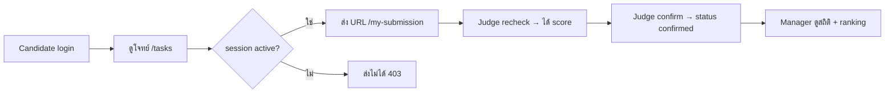

# บทที่ 1 — ภาพรวมระบบ (Real DB)

> **บทนี้เตรียมอะไร:** เห็นภาพรวมทั้งระบบ + **schema ทางการจากไฟล์ `seed_data.sql`** ที่ทุกบทจะอ้างอิง — บทนี้ยังไม่เขียนโค้ด แต่ต้องจำ schema ให้แม่น เพราะชื่อตาราง/คอลัมน์/สถานะ คือสิ่งที่ทำให้ endpoint ทำงานถูกหรือพัง

## ระบบที่จะสร้าง

**Test Submission Management System** — ระบบรับส่งผลงานในห้องแข่งขัน มี 3 บทบาท

| บทบาท | ทำอะไรได้ |
|-------|----------|
| 🎓 Candidate | ดูโจทย์ · ส่ง/แก้ URL ผลงาน · ดูคะแนนตัวเอง |
| ⚖️ Judge | เปิด/ปิด session · ดูผู้เข้าแข่ง · ตรวจซ้ำ (recheck) · ยืนยันคะแนน (confirm) |
| 📊 Manager | ดูสถิติ · ranking · export report (อ่านอย่างเดียว) |

## 🗄️ Schema ทางการ — หัวใจของทุกบท

ไฟล์ `seed_data.sql` กำหนด 5 ตารางนี้ **ห้ามจำสลับกับเวอร์ชันเดิม**

```sql
CREATE TABLE users (
    id INT AUTO_INCREMENT PRIMARY KEY,
    username VARCHAR(50) UNIQUE NOT NULL,
    password VARCHAR(255) NOT NULL,           -- plain-text (ไม่มี bcrypt)
    role VARCHAR(20) NOT NULL,                 -- 'candidate' | 'judge' | 'manager'
    full_name VARCHAR(100) NOT NULL,
    candidate_code VARCHAR(20) NULL            -- รหัสผู้เข้าแข่ง (C01..) — null สำหรับ judge/manager
);

CREATE TABLE sessions (
    id INT AUTO_INCREMENT PRIMARY KEY,
    status VARCHAR(20) NOT NULL DEFAULT 'initialized', -- 'initialized' | 'active' | 'closed'
    updated_at TIMESTAMP DEFAULT CURRENT_TIMESTAMP ON UPDATE CURRENT_TIMESTAMP
);

CREATE TABLE tasks (
    id INT AUTO_INCREMENT PRIMARY KEY,
    title VARCHAR(255) NOT NULL,
    description TEXT
);

CREATE TABLE submissions (
    id INT AUTO_INCREMENT PRIMARY KEY,
    candidate_id INT NOT NULL,
    task_id INT NOT NULL,                      -- ผูกกับ task (ไม่ใช่ session)
    frontend_url VARCHAR(255),
    backend_url VARCHAR(255),
    status VARCHAR(20) DEFAULT 'submitted',    -- 'submitted' | 'recheck' | 'confirmed'
    created_at TIMESTAMP DEFAULT CURRENT_TIMESTAMP,
    FOREIGN KEY (candidate_id) REFERENCES users(id),
    FOREIGN KEY (task_id) REFERENCES tasks(id)
);

CREATE TABLE results (
    id INT AUTO_INCREMENT PRIMARY KEY,
    submission_id INT NOT NULL,
    score DECIMAL(5,2) DEFAULT 0.00,           -- คะแนนตัวเดียว
    status VARCHAR(20) DEFAULT 'pending',      -- 'pending' | 'confirmed'
    FOREIGN KEY (submission_id) REFERENCES submissions(id)
);
```

::: warning จำ  5 จุดนี้ให้ขึ้นใจ
1. ตารางชื่อ `sessions` (ไม่ใช่ `test_sessions`)
2. รหัสผ่านเก็บ **plain-text** ในคอลัมน์ `password` → login เทียบตรงๆ ไม่ต้อง bcrypt
3. `submissions` ผูกกับ **`task_id`** ไม่ใช่ `session_id`
4. `results` มี **`score` ตัวเดียว** + `status` (ไม่มี frontend_score/backend_score/total_score/is_confirmed)
5. หา result ของ candidate ต้อง **JOIN ผ่าน `submissions`** เพราะ `results` ไม่มี `candidate_id`
6. `users` มี **`candidate_code`** (รหัสผู้เข้าแข่ง เช่น C01) — null สำหรับ judge/manager
:::

::: tip จับเวลาสอบ / ปิด session อัตโนมัติ = บทเสริม
core ปิด session ด้วย judge เอง (บท 17) ก็พอ — ส่วน "นับถอยหลัง + ปิดเองเมื่อหมดเวลา" เป็นออปชัน (คะแนนน้อย จำยาก) แยกไว้ที่ [บทเสริม](/backend-real-db/26-session-timer)
:::

## ข้อมูลเริ่มต้น (Seed)

`seed_data.sql` ใส่ข้อมูลตั้งต้นมาให้ — บัญชีเป็น plain-text ใช้ login ได้เลย

| username | password | role | candidate_code |
|----------|----------|------|----------------|
| `admin` | `password` | judge | — |
| `manager` | `password` | manager | — |
| `candidate1` | `123456` | candidate | `C01` |
| `candidate2` | `123456` | candidate | `C02` |

มี session 1 แถว (`initialized`), task 1 แถว, submission ตัวอย่างของ candidate1 และ result ตัวอย่าง 1 แถว

## ลำดับการทำงานของระบบ



## Tech Stack & Endpoint ทั้งหมด

| ส่วน | ค่า |
|------|-----|
| Backend | Node.js + Express (port **8080**) |
| Database | MariaDB ชื่อ **`worldskill2026_real`** |
| รูปแบบ response | `{ success, data, meta }` หรือ `{ success: false, message }` |

18 endpoint หลัก แบ่งเป็น auth, shared (config/tasks), candidate (3), judge (5), manager (4) — เดี๋ยวสร้างทีละตัวในบทถัดๆ ไป

::: tip บทถัดไป
บทที่ 2 ติดตั้งเครื่องมือ (Node, MariaDB, Postman) ให้พร้อมก่อนลงมือ
:::
