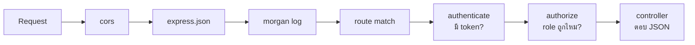

# บทที่ 11 — Architecture & app.js

> **บทนี้เตรียมอะไร:** สร้าง middleware `authorize` (เช็ก role), ประกอบ `src/app.js` ตัวเต็มที่ต่อทุก route, และเข้าใจ "ด่าน" ที่ request วิ่งผ่าน — จบบทนี้โครงสร้างพร้อมเติม endpoint ทีละตัว

## 1. `src/middlewares/role.js`

`authenticate` บอกว่า "เป็นใคร" — `authorize` บอกว่า "role นี้เข้าได้ไหม"

```js
function authorize(...roles) {
  return (req, res, next) => {
    if (!roles.includes(req.user.role)) {
      return res.status(403).json({ success: false, message: 'Access denied' });
    }
    next();
  };
}

module.exports = authorize;
```

ใช้แบบ `authorize('judge')` หรือ `authorize('judge', 'manager')` — รับได้หลาย role

## 2. `src/app.js` ตัวเต็ม

```js
require('dotenv').config();
const express = require('express');
const cors = require('cors');
const morgan = require('morgan');

const app = express();

app.use(cors());
app.use(express.json());
app.use(morgan('short'));

app.use('/api', require('./routes/auth'));
app.use('/api', require('./routes/config'));
app.use('/api', require('./routes/tasks'));
app.use('/api', require('./routes/submissions'));
app.use('/api', require('./routes/results'));
app.use('/api', require('./routes/candidates'));
app.use('/api', require('./routes/session'));
app.use('/api', require('./routes/statistics'));
app.use('/api', require('./routes/report'));

const PORT = process.env.PORT || 8080;
app.listen(PORT, () => console.log(`Backend running on http://localhost:${PORT}`));
```

::: tip ไม่มี `routes/sessions`
ไม่มี endpoint `GET /sessions` (manager ดูประวัติ session) — ระบบเป็น single-session (บท 17) จึงมี 9 route ตามด้านบน
:::

::: tip route ยังไม่ครบตอนนี้ก็ไม่เป็นไร
เพิ่มบรรทัด `app.use('/api', require('./routes/...'))` ทีละตัวตามบทที่สร้าง route นั้นจริง ไม่ต้องใส่ครบหมดตั้งแต่ตอนนี้ (ไฟล์ที่ยังไม่มีจะทำให้ server error)
:::

::: tip ปิด session อัตโนมัติเมื่อหมดเวลา (ออปชัน)
core ปิด session ด้วย judge เท่านั้น (ไม่มี middleware `autoClose` แบบเวอร์ชันเดิม) — ถ้าต้องการ "หมดเวลา → ปิดเอง" ดู [บทเสริม: จับเวลาสอบ + ปิด session อัตโนมัติ](/backend-real-db/26-session-timer)
:::

## ด่านที่ request วิ่งผ่าน (Middleware Stack)



- request ทั่วไป (เช่น `/api/login`) ผ่าน cors → json → morgan → route → controller
- endpoint ที่ต้องล็อกอินจะมี `authenticate` คั่นเพิ่ม
- endpoint ของ judge/manager จะมี `authorize('judge')` คั่นอีกชั้น

## โครงไฟล์ตอนนี้

```
src/
├── app.js                    ← ประกอบทุกอย่าง
├── config/db.js              ← pool
├── middlewares/
│   ├── auth.js               ← authenticate (เช็ก token)
│   └── role.js               ← authorize (เช็ก role)
├── controllers/
│   └── authController.js     ← login, logout
└── routes/
    └── auth.js               ← /login, /logout
```

> หมายเหตุ: `config/schema.js` + `utils/session.js` เป็นของ **บทเสริม** (จับเวลา/auto-close) — core ไม่ต้องมี

พร้อมแล้ว → บทที่ 12 เริ่มสร้าง endpoint จริง (config) โดยใช้โครงนี้
