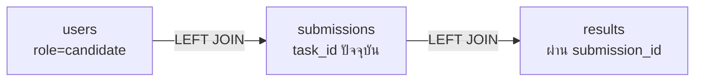

# บทที่ 18 — Candidates (รายชื่อผู้เข้าแข่ง)

> **บทนี้เตรียมอะไร:** สร้าง `GET /api/candidates` ให้ judge เห็นตารางรวม: ผู้เข้าแข่งทุกคน + งานที่ส่ง + คะแนน — ใช้ `LEFT JOIN` 2 ชั้นเพื่อรวมข้อมูล 3 ตารางในครั้งเดียว

## endpoint นี้ทำอะไร

คืน candidate ทุกคน (role = candidate) พร้อมข้อมูล submission และ result ของ task ปัจจุบัน (ถ้ามี) — คนที่ยังไม่ส่งงานก็ต้องโผล่ในรายการ (ค่าเป็น null)

## `src/controllers/candidatesController.js`

```js
const pool = require('../config/db');

async function getCurrentTaskId() {
  const [rows] = await pool.execute('SELECT id FROM tasks ORDER BY id ASC LIMIT 1');
  return rows[0] ? rows[0].id : null;
}

async function getCandidates(req, res) {
  try {
    const taskId = await getCurrentTaskId();

    const [rows] = await pool.execute(`
      SELECT
        u.id, u.username, u.full_name, u.candidate_code,
        s.id            AS submission_id,
        s.status        AS submission_status,
        s.frontend_url,
        s.backend_url,
        s.created_at,
        r.score,
        r.status        AS result_status
      FROM users u
      LEFT JOIN submissions s ON u.id = s.candidate_id AND s.task_id = ?
      LEFT JOIN results     r ON r.submission_id = s.id
      WHERE u.role = 'candidate'
      ORDER BY u.full_name ASC
    `, [taskId]);

    res.json({ success: true, data: rows, meta: {} });
  } catch {
    res.status(500).json({ success: false, message: 'Server error' });
  }
}

module.exports = { getCandidates };
```

## เข้าใจ JOIN



- เริ่มจาก `users` ทุก candidate → **LEFT** JOIN เพื่อให้คนที่ยังไม่ส่งงานยังอยู่ในผล (submission เป็น null)
- ต่อ `results` ผ่าน `r.submission_id = s.id` (เพราะ results ไม่มี candidate_id)
- ตั้งชื่อใหม่กัน `status` ชนกัน: `submission_status` (ของ submissions) กับ `result_status` (ของ results)

::: warning จุดต่างจากเวอร์ชันเดิม
คืน `r.score` (คะแนนเดียว) + `result_status` — ไม่มี `frontend_score`/`backend_score`/`total_score`/`is_confirmed` และ JOIN results ด้วย `submission_id` (เวอร์ชันเดิม JOIN ด้วย candidate_id + session_id)
:::

## `src/routes/candidates.js`

```js
const router       = require('express').Router();
const authenticate = require('../middlewares/auth');
const authorize    = require('../middlewares/role');
const { getCandidates } = require('../controllers/candidatesController');

router.get('/candidates', authenticate, authorize('judge'), getCandidates);

module.exports = router;
```

ต่อเข้า `app.js`:

```js
app.use('/api', require('./routes/candidates'));   // [!code ++]
```

## ทดสอบ

login judge → `GET /api/candidates` → ได้ array 2 คน

```json
[
  { "id": 3, "username": "candidate1", "candidate_code": "C01", "submission_id": 1, "submission_status": "submitted", "score": "45.50", "result_status": "pending" },
  { "id": 4, "username": "candidate2", "candidate_code": "C02", "submission_id": null, "score": null, "result_status": null }
]
```

candidate2 ยังไม่ส่ง → ฟิลด์ submission/result เป็น null แต่ยังอยู่ในรายการ (ผลของ LEFT JOIN)
