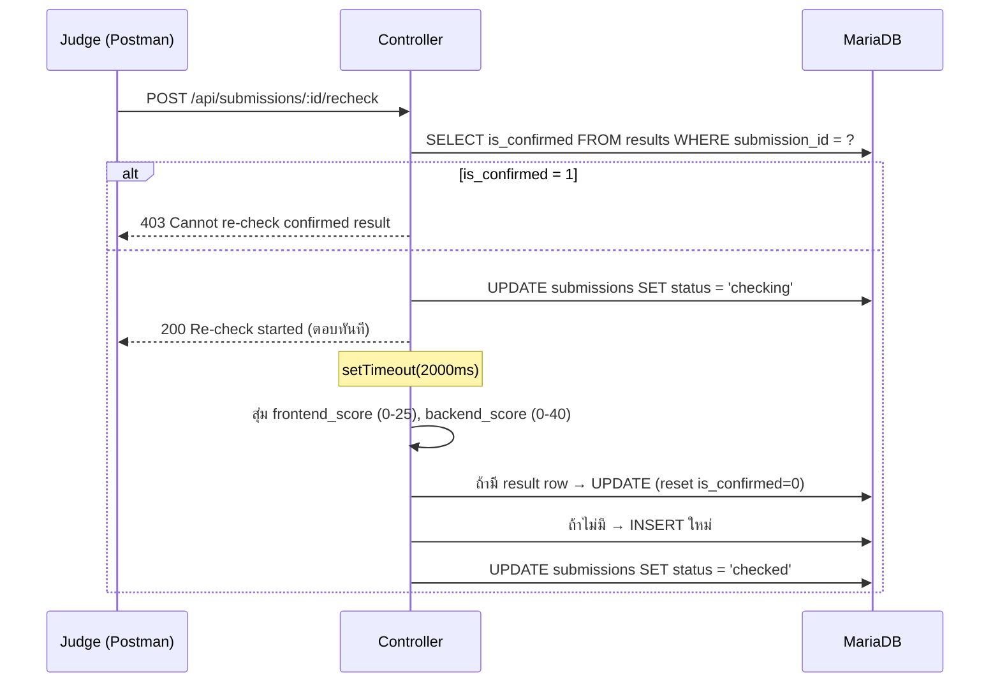

# บทที่ 23 — Recheck

## POST /api/submissions/:id/recheck

> Judge ต้องการประเมินผลงานของ candidate ใหม่ (สุ่มคะแนน) — จึงต้องมี endpoint นี้

## Flow Diagram — logic พิเศษที่ต่างจาก endpoint ทั่วไป



:::warning
endpoint ตอบกลับทันที (`200 Re-check started`) แล้ว logic คะแนนทำงานใน background หลัง 2 วินาที
:::

```
backend/
└── src/
    ├── controllers/
    │   └── submissionsController.js   ← แก้ในบทนี้ (เพิ่ม recheckSubmission)
    └── routes/
        └── submissions.js             ← แก้ในบทนี้ (เพิ่ม recheck route)
```

**`routes/submissions.js`** — เพิ่ม recheck route

```js
// routes/submissions.js — บทที่ 23 เพิ่ม recheck
router.get('/submissions',                authenticate, authorize('judge'), ctrl.getAllSubmissions);
router.post('/submissions/:id/recheck',   authenticate, authorize('judge'), ctrl.recheckSubmission); // [!code ++]
```

**`controllers/submissionsController.js`** — เพิ่ม `recheckSubmission`

```js
// submissionsController.js — บทที่ 23 เพิ่ม recheckSubmission
async function recheckSubmission(req, res) {                                 // [!code ++]
  try {                                                                      // [!code ++]
    const { id } = req.params;                                               // [!code ++]
                                                                             // [!code ++]
    const [rows] = await pool.execute(                                       // [!code ++]
      'SELECT * FROM submissions WHERE id = ?', [id]                         // [!code ++]
    );                                                                       // [!code ++]
    if (rows.length === 0) {                                                 // [!code ++]
      return res.status(404).json({ success: false, message: 'Submission not found' }); // [!code ++]
    }                                                                        // [!code ++]
                                                                             // [!code ++]
    const [confirmed] = await pool.execute(                                  // [!code ++]
      'SELECT id FROM results WHERE submission_id = ? AND is_confirmed = 1', [id] // [!code ++]
    );                                                                       // [!code ++]
    if (confirmed.length > 0) {                                              // [!code ++]
      return res.status(403).json({ success: false, message: 'Cannot re-check a confirmed result' }); // [!code ++]
    }                                                                        // [!code ++]
                                                                             // [!code ++]
    await pool.execute("UPDATE submissions SET status = 'checking' WHERE id = ?", [id]); // [!code ++]
                                                                             // [!code ++]
    setTimeout(async () => {                                                 // [!code ++]
      const frontendScore = parseFloat((Math.random() * 25).toFixed(2));    // [!code ++]
      const backendScore  = parseFloat((Math.random() * 40).toFixed(2));    // [!code ++]
      const totalScore    = parseFloat((frontendScore + backendScore).toFixed(2)); // [!code ++]
      const sub           = rows[0];                                         // [!code ++]
                                                                             // [!code ++]
      await pool.execute("UPDATE submissions SET status = 'checked' WHERE id = ?", [id]); // [!code ++]
                                                                             // [!code ++]
      const [existing] = await pool.execute(                                 // [!code ++]
        'SELECT id FROM results WHERE submission_id = ?', [id]              // [!code ++]
      );                                                                     // [!code ++]
      if (existing.length > 0) {                                             // [!code ++]
        await pool.execute(                                                  // [!code ++]
          `UPDATE results SET frontend_score=?, backend_score=?, total_score=?,
             is_confirmed=0, confirmed_by=NULL, confirmed_at=NULL
           WHERE submission_id=?`,                                           // [!code ++]
          [frontendScore, backendScore, totalScore, id]                      // [!code ++]
        );                                                                   // [!code ++]
      } else {                                                               // [!code ++]
        await pool.execute(                                                  // [!code ++]
          `INSERT INTO results (submission_id, candidate_id, session_id, frontend_score, backend_score, total_score)
           VALUES (?, ?, ?, ?, ?, ?)`,                                       // [!code ++]
          [id, sub.candidate_id, sub.session_id, frontendScore, backendScore, totalScore] // [!code ++]
        );                                                                   // [!code ++]
      }                                                                      // [!code ++]
    }, 2000);                                                                // [!code ++]
                                                                             // [!code ++]
    res.json({ success: true, data: { message: 'Re-check started' }, meta: {} }); // [!code ++]
  } catch {                                                                  // [!code ++]
    res.status(500).json({ success: false, message: 'Server error' });       // [!code ++]
  }                                                                          // [!code ++]
}                                                                            // [!code ++]

module.exports = {
  getMySubmission, createSubmission, updateSubmission,
  getAllSubmissions, recheckSubmission,                                       // [!code ++]
};
```

**ทดสอบ Postman:**

```
POST http://localhost:8080/api/submissions/1/recheck
Authorization: Bearer <token ของ judge01>
```

ต้องได้ทันที:
```json
{ "success": true, "data": { "message": "Re-check started" }, "meta": {} }
```

รอ 2 วินาที แล้วตรวจ GET /api/candidates → ต้องเห็น `frontend_score`, `backend_score`, `total_score` มีค่าแล้ว

> Pattern: Route → Controller → pool.execute() → res.json() — เหมือนทุก endpoint

## Common Errors

| Error | สาเหตุ | วิธีแก้ |
|-------|--------|---------| 
| 403 `Cannot re-check a confirmed result` | judge confirm แล้ว recheck ไม่ได้ | ปกติ — ต้องการให้คะแนนคงที่หลัง confirm |
| 404 `Submission not found` | id ไม่มีใน DB | ตรวจ id จาก GET /api/submissions |
