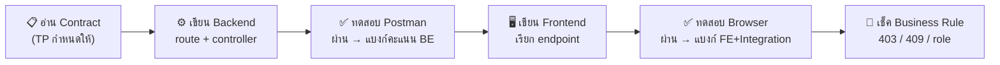

# บทที่ 1 — แผนการรบ 6 ชั่วโมง (Build Order)

> **บทนี้คืออะไร:** หลังเรียน Backend จบ 29 บท และ Frontend จบ 18 บท คุณ "สร้างเป็นทุกชิ้น" แล้ว — บทนี้คือ **ลำดับการลงมือจริงในห้องแข่ง** ว่าควรเขียนชิ้นไหนก่อน-หลัง สลับ BE/FE ยังไง ให้เก็บคะแนนได้มากที่สุดใน 6 ชั่วโมง ภายใต้กติกา LAN ไร้อินเทอร์เน็ต

บทเรียน 47 บทก่อนหน้าสอน **"สร้างแต่ละชิ้นยังไง"** (แนวนอน — BE ครบ แล้ว FE ครบ) ส่วนบทนี้สอน **"เรียงชิ้นยังไงในสนามจริง"** (แนวตั้ง — ทีละฟีเจอร์ทะลุ BE→FE) สองมุมนี้เสริมกัน บทนี้ไม่สอนโค้ดซ้ำ แต่ **ร้อยบทเดิมเข้าเป็นไทม์ไลน์เดียว** พร้อมจุดทดสอบและคะแนนที่ได้ทุกก้าว

## 🧭 หลักคิด 3 ข้อ

### 1. Vertical Slice — สร้างทีละฟีเจอร์ให้ "ทะลุ" จบเป็นชิ้น
อย่าสร้าง BE ครบทุก endpoint แล้วค่อยเริ่ม FE — ถ้าเวลาหมดกลางทาง คุณจะได้ BE ครึ่งตัว + FE ศูนย์ที่ **ต่อกันไม่ติด ใช้งานไม่ได้** เลยสักฟีเจอร์ ให้สร้าง **1 ฟีเจอร์ทะลุ BE→FE→ทดสอบ→จบ** แล้วค่อยขยับชิ้นถัดไป — ทุกชั่วโมงคุณมีระบบที่ "เดโมได้จริง"

### 2. Backend ก่อน Frontend (ภายในแต่ละ slice)
| เหตุผล | อ้างอิงโจทย์ |
|--------|-------------|
| Backend = 40 คะแนน (มากสุด) + TP กำหนด contract มาให้แล้ว | TP §6, §12 |
| ระบบตรวจอัตโนมัติยิง API ด้วย **Newman** — BE เสร็จ = แบงก์คะแนนได้เลยไม่ต้องรอ FE | RSC §8 |
| FE ที่ไม่มี BE จริงให้เรียก ต้อง mock เสียเวลา / BE เสร็จก่อน → FE เขียนตาม contract ได้เป๊ะ | — |

> **ข้อยกเว้น:** ส่วน FE ที่เป็น static (โครง layout Dashboard, ฟอร์ม Login) scaffold ไว้ก่อนได้เลย เพราะไม่พึ่ง BE

### 3. ระบบต้องรันได้ตลอดเวลา (Always-Runnable)
ห้ามทิ้งโค้ดค้างที่ทำให้ server พังข้ามชั่วโมง จบแต่ละ slice ต้อง `npm run dev` ทั้งสองฝั่งแล้ว **ไม่ error** — ระบบตรวจอัตโนมัติเข้ามาเมื่อไหร่ก็เก็บคะแนนส่วนที่เสร็จได้ทันที

## 🔁 Micro-loop ต่อ 1 Slice

ทุก phase ในบทถัดไปเดินวนชุดนี้เหมือนกันหมด — จำชุดนี้ชุดเดียว:

## 🗺️ ลำดับการสร้าง 8 Phase (0–7)

เรียงตาม **dependency** (ของที่ต้องมีก่อน) + **น้ำหนักคะแนน**:

| # | Phase | ต้องมีก่อน | ทดสอบแล้วได้ |
|---|-------|-----------|-------------|
| [0](/integration/02-phase0-foundation) | 🏗️ รากฐาน | — | 2 server คุยกันได้ (ไม่มี CORS error) |
| [1](/integration/03-phase1-auth) | 🔐 Auth | 0 | login → redirect ตาม role |
| [2](/integration/04-phase2-config-tasks) | 📋 Config + Tasks | 1 | candidate เห็น session + โจทย์ + นาฬิกา |
| [3](/integration/05-phase3-session) | ⏱️ Session Lifecycle | 1 | judge เปิด/ปิด → candidate badge เปลี่ยน |
| [4](/integration/06-phase4-submission) | 📤 Candidate Submission | 3 | ส่ง/แก้ URL ภายใต้กฎ 403/409 |
| [5](/integration/07-phase5-judge-results) | ⚖️ Judge + Results | 4 | ตรวจ → ยืนยัน → candidate เห็นผล |
| [6](/integration/08-phase6-manager) | 📊 Manager | 5 | สรุป / ranking / export |
| [7](/integration/09-phase7-polish-deploy) | 🚀 Polish + Deploy | ทั้งหมด | รันบน LAN, seed ผ่าน, README |

:::warning ทำไมต้องเรียงแบบนี้
ทดสอบ **Submission (4)** ต้องมี **Session open (3)** ก่อน · ดู **Result/Confirm (5)** ต้องมี **Submission (4)** ก่อน — ข้ามลำดับ = ทดสอบ happy path ไม่ได้ ต้องย้อนกลับมาทำใหม่ เสียเวลา
:::

## ⏰ Time Budget 6 ชั่วโมง (ปรับตามถนัด)

| Phase | เวลา | สะสม |
|-------|:---:|:---:|
| 0 รากฐาน | 0:30 | 0:30 |
| 1 Auth | 0:45 | 1:15 |
| 2 Config + Tasks | 0:30 | 1:45 |
| 3 Session | 0:30 | 2:15 |
| 4 Submission | 0:45 | 3:00 |
| 5 Judge + Results | 1:15 | 4:15 |
| 6 Manager | 0:45 | 5:00 |
| 7 Polish + Deploy | 0:40 | 5:40 |
| 🛟 buffer / แก้บั๊ก | 0:20 | 6:00 |

ถ่วงน้ำหนักไปที่ **Backend (40)** และ **Phase 5 (slice ใหญ่สุด — รวม Result Flow 7 + Judge Dashboard 8 + Judge APIs)**

:::tip กฎเหล็กเรื่องเวลา
ถ้า phase ไหนเกินเวลาที่ตั้งไว้ **15 นาที** → ข้ามไป phase ถัดที่ทำคะแนนได้ แล้วค่อยย้อนกลับ — อย่าจมกับชิ้นเดียวจนเสียทั้งกระดาน เพราะคะแนนกระจายหลายหมวด (ดูตาราง Marking Map ด้านล่าง)
:::

## 📊 Marking Map (Phase → Rubric)

อิงรูบริก RSC2026 §7:

| Phase | หมวดคะแนนที่แบงก์ | คะแนน |
|-------|------------------|:---:|
| 1 Auth | Authentication & Authorization + Login/Route Guard | 10 + 3.5 |
| 2 Config+Tasks | Candidate Dashboard (countdown/task) | (ส่วนของ 5.5) |
| 3 Session | Session Lifecycle Rules | 4 |
| 4 Submission | Candidate APIs + Submission & Access Rules | 8 + 9 |
| 5 Judge+Results | Judge/Manager APIs (judge) + Judge Dashboard + Result Flow | (18) + 8 + 7 |
| 6 Manager | Judge/Manager APIs (manager) + Manager Dashboard | (18) + 7 |
| 7 Polish | LAN + Offline + Responsive/a11y + API Quality + Maintainability | 6+4+1+4+2 |

## ✅ Constraints Checklist (RSC2026 — ติดไว้ข้างจอ)

ทุกอย่างต้องผ่านข้อเหล่านี้ ไม่งั้นโดนหักทั้งหมวด Deployment (10):

- [ ] ทำงานบน **LAN เท่านั้น** — ไม่มีการเรียกอินเทอร์เน็ตเลย (RSC §5)
- [ ] **ไม่มี** external font / CDN / cloud (เช็ค `<link>`, `@import`, `<script src>` ภายนอก)
- [ ] Frontend เชื่อม Backend **ผ่าน API เท่านั้น** — ห้ามต่อ DB ตรง (TP §10)
- [ ] รันได้กับ **seed data** ที่ให้มา (`npm run seed`)
- [ ] Frontend port **3000** · Backend port **8080** · IP `10.10.0.xxx` (RSC ภาคผนวก A)
- [ ] `CORS origin` ต้องอนุญาต IP/port ของ FE ในห้อง ไม่ใช่ `localhost` อย่างเดียว
- [ ] response ทุกตัวตรง format `{ success, data, meta }` / `{ success, message }` (TP §6)

➡️ เริ่มที่ [Phase 0 — รากฐาน](/integration/02-phase0-foundation): ทำให้ 2 server คุยกันได้ก่อนเขียนฟีเจอร์แรก
