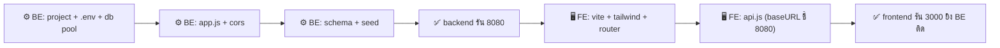

# บทที่ 2 — Phase 0: รากฐาน (Foundation)

> 🎯 **เป้าหมาย:** ทำให้ **2 server คุยกันได้** — backend รันที่ 8080, frontend รันที่ 3000, และ frontend ยิงหา backend ได้โดย **ไม่มี CORS error** ก่อนเขียนฟีเจอร์แรกแม้แต่ตัวเดียว
>
> ⏱️ **เวลา:** ~0:30 · 🏆 **คะแนน:** ยังไม่ได้ตรง ๆ แต่ **เปิดทางทุก phase** + วางฐาน Code Structure (RSC §7)

:::tip ทำไมต้องมี Phase 0
80% ของเวลาที่เสียไปฟรีในห้องแข่งคือ "เขียนฟีเจอร์เสร็จแล้วแต่ต่อไม่ติด" เพราะ CORS / baseURL / .env ผิด — Phase นี้กำจัดปัญหานั้นทิ้งตั้งแต่ต้น ทดสอบให้ผ่านก่อน แล้วที่เหลือจะลื่น
:::

## 🧭 ลำดับใน Phase นี้ (BE ก่อน → FE)



---

## ⚙️ Backend — วางรากฐานฝั่ง server

> เต็ม ๆ อยู่ใน [บท 3 Setup](/backend/03-setup) → [4 Express](/backend/04-express) → [6 dotenv](/backend/06-dotenv) → [7 cors](/backend/07-cors) → [8 Database](/backend/08-database) → [9 mysql2](/backend/09-mysql2) — ที่นี่ดูเฉพาะ **จุดเชื่อม**

### ลำดับไฟล์ที่ต้องมี

| ไฟล์ | หน้าที่ | บทเต็ม |
|------|--------|:---:|
| `backend/.env` | ค่าลับ: DB, `JWT_SECRET`, `FRONTEND_URL`, `PORT` | [6](/backend/06-dotenv) |
| `backend/src/config/db.js` | connection pool ไป MariaDB | [9](/backend/09-mysql2) |
| `backend/src/app.js` | express + cors + mount routes | [4](/backend/04-express),[7](/backend/07-cors) |
| `backend/database/schema.sql` | โครงตาราง (users, sessions, submissions, results) | [8](/backend/08-database) |
| `backend/database/seed.js` | ใส่ user/session เริ่มต้น | [8](/backend/08-database) |

### จุดเชื่อม 1 — `.env` (ตัวแปรที่ทุก phase พึ่ง)

```bash
# backend/.env
DB_HOST=localhost
DB_PORT=3306
DB_USER=root
DB_PASSWORD=yourpassword
DB_NAME=worldskill
JWT_SECRET=change-this-secret        # ← Phase 1 ใช้เซ็น token
FRONTEND_URL=http://localhost:3000   # ← CORS อนุญาต origin นี้
PORT=8080
```

:::warning ในห้องแข่งจริง `FRONTEND_URL` ไม่ใช่ localhost
ระบบตรวจ + กรรมการเข้าจาก **IP ในห้อง** (เช่น `http://10.10.0.105:3000`) ถ้า `FRONTEND_URL=http://localhost:3000` อย่างเดียว → CORS block เครื่องอื่น ดู [Phase 7](/integration/09-phase7-polish-deploy) เรื่องตั้งค่า LAN
:::

### จุดเชื่อม 2 — `app.js` (ประตูที่ FE จะวิ่งเข้า)

```js
// backend/src/app.js — 3 บรรทัดที่ทำให้ FE ต่อติด
app.use(cors({ origin: process.env.FRONTEND_URL }));  // [!code highlight] อนุญาต FE
app.use(express.json());                              // [!code highlight] แปลง JSON body → req.body
app.use('/api', require('./routes/auth'));            // ทุก route ขึ้นต้น /api
```

### ✅ ทดสอบปิด Backend

```bash
cd backend
npm install
npm run seed        # สร้างตาราง + ใส่ seed (session id=1, status=waiting)
npm run dev         # ต้องเห็น: Backend running on http://localhost:8080
```

ยิงทดสอบใน Postman — เอา endpoint สาธารณะที่เบาสุด:

```
POST http://localhost:8080/api/login
Body: { "username": "candidate01", "password": "cand123" }
```

ได้ `success: true` + `token` = **Backend พร้อม** (ฟีเจอร์ login เต็ม ๆ ทำใน [Phase 1](/integration/03-phase1-auth))

---

## 🖥️ Frontend — วางรากฐานฝั่ง client

> เต็ม ๆ อยู่ใน [บท 1 Setup](/frontend/01-setup) → [3 Tailwind](/frontend/03-tailwind) → [6 Axios](/frontend/06-axios) → [7 Router](/frontend/07-router) → [8 AuthContext](/frontend/08-auth-context)

### ลำดับไฟล์ที่ต้องมี

| ไฟล์ | หน้าที่ | บทเต็ม |
|------|--------|:---:|
| `vite.config.js` | ตั้ง dev server **port 3000** | [1](/frontend/01-setup) |
| `src/services/api.js` | axios instance — **baseURL ชี้ 8080** + แนบ token | [6](/frontend/06-axios) |
| `src/contexts/AuthContext.jsx` | เก็บ user/token ทั้งแอป | [8](/frontend/08-auth-context) |
| `src/App.jsx` | `<AuthProvider>` + `<BrowserRouter>` ครอบ route | [7](/frontend/07-router) |

### จุดเชื่อม 3 — `api.js` (สายที่ลากไปหา Backend)

```js
// frontend/src/services/api.js — สายเดียวที่ทุก component ใช้ยิง BE
const api = axios.create({
  baseURL: import.meta.env.VITE_API_URL || 'http://localhost:8080/api',  // [!code highlight]
});
```

:::tip baseURL ต้อง "ตรงข้าม" กับ FRONTEND_URL ฝั่ง BE
`api.js baseURL` → ชี้ไป **Backend** (8080) ส่วน `FRONTEND_URL` ฝั่ง BE → ชี้กลับมา **Frontend** (3000) สองค่านี้คือปลายสองข้างของสายเส้นเดียวกัน ตั้งให้ตรงห้อง LAN ทั้งคู่
:::

### จุดเชื่อม 4 — `App.jsx` (ครอบทั้งแอปด้วย AuthProvider)

```jsx
// frontend/src/App.jsx — AuthProvider ครอบ → ทุกหน้าเรียก useAuth() ได้
export default function App() {
  return (
    <AuthProvider>          {/* [!code highlight] */}
      <BrowserRouter>
        <Routes>
          <Route path="/login" element={<Login />} />
          {/* route อื่นเพิ่มทีละ phase */}
        </Routes>
      </BrowserRouter>
    </AuthProvider>
  );
}
```

### ✅ ทดสอบปิด Frontend

```bash
cd frontend
npm install
npm run dev         # ต้องเห็น: Local: http://localhost:3000
```

เปิดเบราว์เซอร์ → DevTools (F12) → Console — ยังไม่มีหน้า login ก็ได้ ขอแค่ **ไม่มี error สีแดง**

---

## 🔗 ทดสอบจุดเชื่อม BE ↔ FE (หัวใจของ Phase นี้)

วางโค้ดยิง API ชั่วคราวใน component ไหนก็ได้ แล้วดู DevTools → Network:

```js
import api from './services/api';
api.post('/login', { username: 'candidate01', password: 'cand123' })
   .then(r => console.log('เชื่อมติด ✅', r.data))
   .catch(e => console.error('เชื่อมไม่ติด ❌', e));
```

| เห็นแบบนี้ | แปลว่า |
|-----------|--------|
| `เชื่อมติด ✅ { success: true, ... }` | ผ่าน! ทั้งระบบพร้อมต่อ Phase 1 |
| `CORS policy ... blocked` | `FRONTEND_URL` ฝั่ง BE ไม่ตรง origin ของ FE |
| `Network Error` / `ERR_CONNECTION_REFUSED` | backend ไม่ได้รัน / baseURL ผิด port |
| `404 /api/login` | route ไม่ได้ mount / พิมพ์ path ผิด |

---

## ☑️ Checkpoint ปิด Phase 0

ข้ามไป Phase 1 ได้เมื่อ **ครบทุกข้อ**:

- [ ] `npm run seed` ผ่าน — มี seed data ในฐานข้อมูล
- [ ] backend รันที่ **8080** ไม่ error
- [ ] frontend รันที่ **3000** ไม่ error
- [ ] FE ยิง `POST /api/login` แล้วได้ `success: true` — **ไม่มี CORS error**
- [ ] `.env` มี `JWT_SECRET` และ `FRONTEND_URL` ครบ (Phase 1 ต้องใช้ทันที)

➡️ ฐานพร้อม — ไปต่อ [Phase 1: Auth](/integration/03-phase1-auth) สร้างฟีเจอร์ login ให้ทะลุ BE→FE เป็น slice แรกจริง
